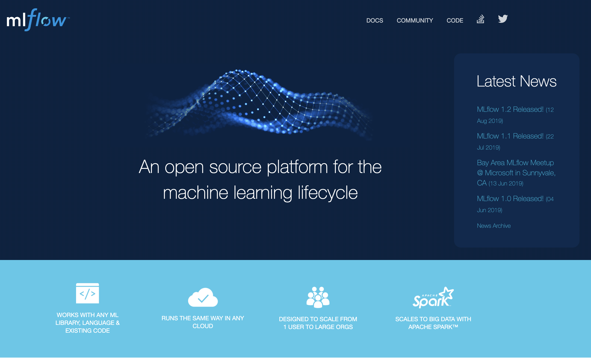
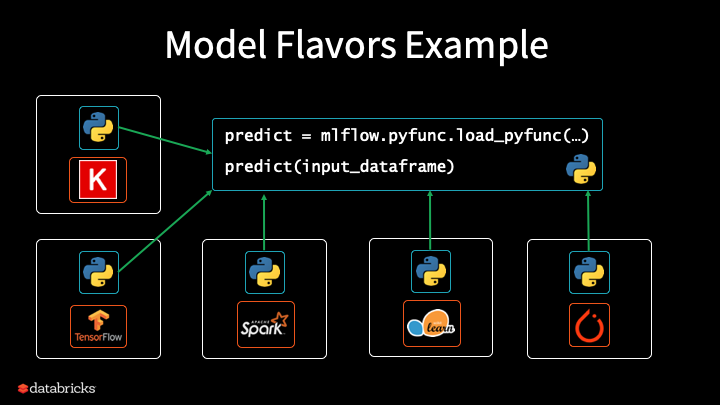
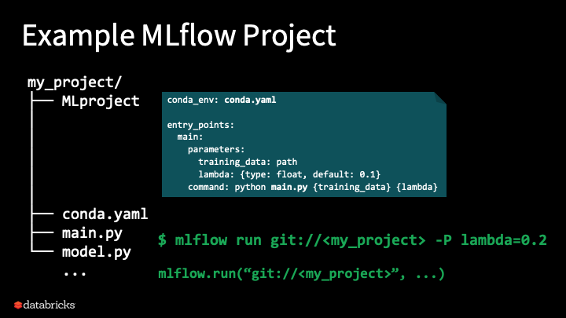

 # READ THIS NOW BEFORE CLONING: 

## This repo has been deprecated and moved to [a new tutorials repo](https://github.com/dmatrix/tutorials)

# MLflow Tutorial for 2019 Conferences
## Agenda
 * Overview of ML development challenges
 * How MLflow tackles these
 * MLflow Components
   * Mlflow Tracking
   * MLflow Projects
   * MLflow Models
   * MLflow Registry
 * Managed MLflow MLlib + Registry Demo
 * Q & A
 * (Break?)
 * Set up Environment
 * Hands-on Tutorial
### Prerequisites 
1. Knowledge of Python 3 and programming in general
2. Preferably a UNIX-based, fully-charged laptop with 8-16 GB, with a Chrome or Firefox browser
3. Familiarity with GitHub, git, and an account on Github
4. Some Knowledge of some Machine Learning concepts, libraries, and frameworks 
     * scikit-Learn
     * pandas and Numpy
     * TensorFlow/Keras
5. PyCharm/IntelliJ or choice of syntax-based Python editor
6. pip/pip3 and Python 3 installed
7. Loads of laughter, curiosity, and a sense of humor ... :-)

### Installation and Setup environment

1. Open MLflow [docs](https://mlflow.org) and scikit-learn [docs](https://scikit-learn.org/stable/index.html) in your browser. Keep this tab open.
2. `git clone git@github.com:dmatrix/spark-saturday.git` or `git clone https://github.com/dmatrix/spark-saturday.git`
3. `cd <your_cloned_directory>/tutorials/mlflow/src/python`
4. Install MLflow and the required Python modules 
    * `pip install -r req.txt` or `pip3 install -r req.txt`
5. `cd labs`
6. If using PyCharm or IntelliJ, create a project and load source files in the project
7. Pre-register for [Databricks Community Edition](https://databricks.com/try-databricks)

### Configuring local host with MLflow Credentials for Community Edition (CE)

**Note**: This step is **only** required if you're going to use CE to track experiment runs

Good [Resource Blog](https://databricks.com/blog/2019/10/17/managed-mlflow-now-available-on-databricks-community-edition.html)

1. Run from your shell `databricks configure`
2. Answer the prompts
3. **Databricks Host (should begin with https://)**: _https://community.cloud.databricks.com_
4. **Username**: _enter your community edition login credentials_
5. **Password**: _enter password for community edition_
6. Configure MLflow to communicate with the Community Edition server: `export MLFLOW_TRACKING_URI=databricks`
7. Test out your configuration by creating an experiment via the CLI: `mlflow experiments create -n /Users/username@email_addr/my-experiment`

### Documentation Resources

1. [MLflow](https://mlflow.org/docs/latest/index.html) 
2. [Numpy](https://numpy.org/devdocs/user/quickstart.html)
3. [Pandas](https://pandas.pydata.org/pandas-docs/stable/reference/index.html)
4. [Scikit-Learn](https://scikit-learn.org/stable/index.html)
5. [Keras](https://keras.io/optimizers/)
6. [TensorFlow](https://tensorflow.org)

## Labs 
The general objective of the labs are to familiarize you with MLflow APIs and how these
APIs facilitate different machine learning cycle: from creating a baseline or a benchmark model to 
creating many experimental models by tuning parameters to produce a best outcome; from understanding
how to package an MLflow project as a unit of execution and sharing to learning about MLflow model flavors
and their flexibility to deploy them. 

All this is achieved by experimenting and tracking the effects of different models, developed with different ML
algorithms and using MLflow APIs. In simple terms:

1. Train a base line model with initial parameters
2. Record the relevant metrics and parameters with MLflow APIs
3. Observe the results via MLflow UI
4. Change or tweak relevant parameters
5. Test or evaluate model
6. Repeat 2-5 until satisfied
7. Deploy your model flavor

This iterative process is recurrent in each of the lab, as part of model management life cycle. 

### Lab-1: Scikit-Learn Regression with RandomForestRegressor 
 [_petrol_regression_lab_1.py_](./labs/petrol_regression_lab_1.py)
 
 [_tensorflow_keras_petrol_regression_lab_1.py_](./labs/tensorflow_keras_petrol_regression_lab_1.py)
### Problem
Part 1: We want to predict the gas consumption in millions of gallons in 48 of the US states
based on some key features. These features are petrol tax (in cents), per capital income (in US dollars),
paved highway (in miles), population of people with driving licences.
### Solution
Since this is a regression problem where the value is a range of numbers, we can use the
common Random Forest Algorithm in Scikit-Learn. Most regression models are evaluated with
three standard evalution metrics: Mean Absolute Error(MAE); Mean Squared Error (MSE); and
Root Mean Squared Error (RSME), and r2 score.

### Sample Data
|Petrol_tax	|Average_income|	Paved_Highways|	Population_Driver_license(%)|	Petrol_Consumption|
|-----------|--------------|------------------|-----------------------------|---------------------|
|9.0	    |    3571	   |     1976	      | 0.525	                    |   541               |
|9.0	    |    4092	   |     1250	      | 0.572	                    |   524               |
|9.0	    |   3865	   |     1586	      | 0.580	                    |   561               |
|7.5	    |   4870	   |     2351	      | 0.529	                    |   414               |
|8.0	    |   4399	   |     431	      | 0.544	                    |   410               |

 Objectives of this Lab: 
 
 * Use _RandomForestRegressor_ Model
 * How to use the MLflow API
 * Use the MLflow API to experiment several Runs
 * Interpret and observe runs via the MLflow UI
 
#### Lab-1 Exercise: 

 1. Consult [RandomForestRegressor](https://scikit-learn.org/stable/modules/generated/sklearn.ensemble.RandomForestRegressor.html) documentation 
 2. Change or alter the range of runs and increments of n_estimators, random_state etc.
 3. Change or alter the range of runs and increments of n_estimators
 4. Check in MLfow UI if the metrics are affected
 
 *_challenge-1_:* Create mean square error or r2 artifacts and save them for each run
 
 Refresh on [Regression Metrics](https://www.dataquest.io/blog/understanding-regression-error-metrics/)
 
 Refresh on [RandomForest](https://towardsdatascience.com/understanding-random-forest-58381e0602d2)
 
 Source for [Lab 1 & 2](https://stackabuse.com/random-forest-algorithm-with-python-and-scikit-learn/)
 
 Data source for [lab 1 & 2](https://archive.ics.uci.edu/ml/datasets/banknote+authentication)

### Lab-2: Scikit-Learn Classification with RandomForestClassifier
* [_banknote_classification_lab_2.py_](./labs/banknote_classification_lab_2.py)

### Problem
Part 2: Given a set of features or attributes of a bank note, can we predict whether it's authentic or fake?
Four attributes, extracted from wavelet transformed images, contribute as independent variables to this classification:

 1. Image.Var (Variance of Wavelet Transformed image (WTI))
 2. Image.Skew (Skewness of WTI)
 3. Image.Curt (Curtosis of WTI)
 4. Entropy (Entropy of image)
 5. Class (Whether or not the banknote was authentic; zero=fake; one=authentic)
### Solution
We are going to use Random Forest Classification to make the prediction, and measure on the accuracy.
The closer to 1.0 is the accuracy the better is our confidence in its prediction.
### Sample Data
|Variance	|Skewness      |	Curtosis|	Entropy|	Class|
|-----------|--------------|------------|----------|---------|
|3.62160	|   8.6661	   |     -2.807 | -0.44699 |   0     |
|4.54590    |   8.1674     |    -2.4586 | -1.46210 |   0     |
|3.86600    |   -2.6383    |   1.9242   | 0.10645  |   0     |
|3.45660    |  9.5228	   |    4.0112  | -3.59440|    0     |

Objectives of this lab:
 * Use a RandomForestClassification Model
 * How to use the MLflow Tracking API
 * Use the MLflow API to experiment several runs
 * Interpret and observe runs via the MLflow UI
 
#### Lab-2 Exercise: 
  * Consult [RandomForestClassifier](https://scikit-learn.org/stable/modules/generated/sklearn.ensemble.RandomForestClassifier.html) documentation
  * Change or add parameters, such as depth of the tree or random_state, etc.
  * Change or alter the range of runs and increments of n_estimators
  * Check in MLflow UI if the metrics are affected
  * Log confusion matrix, recall and F1-score as metrics
   
 *_challenge-1_:* Use linear regression or SVM algorithm and see if it makes a difference in the evaluation metrics. This is a classic scenario where
 MLflow allows you to experiment, record, and evaluate three different algorithms to pick the best one, after
 experimentation and evaluation. 
 **Hint**: Read the blog below on using three algorithms
 
 Nice blog on [RF, SVM, & LR](https://www.vshsolutions.com/blogs/banknote-authentication-using-machine-learning-algorithms/) on detecting fake notes

 Refresh on [Classification Metrics](https://joshlawman.com/metrics-classification-report-breakdown-precision-recall-f1/)
 
 Refresh on [RandomForest](https://towardsdatascience.com/understanding-random-forest-58381e0602d2)
 
 Source for [Lab 1 & 2](https://stackabuse.com/random-forest-algorithm-with-python-and-scikit-learn/)
 
 Data source for [lab 1 & 2](https://archive.ics.uci.edu/ml/datasets/banknote+authentication)

### Lab-3: Scikit-Learn Regression Base with RandomForestRegressor 
  * [_airbnb_base_lab_3.py_](./labs/airbnb_base_lab_3.py)
### Problem
Take a cleansed, featurized dataset from AirBnB listing and develop a base line model to predict prices.  
### Solution
Use RandomForestRegressor and baseline  parameters to predict the price, given all the features.
### Sample Data
|host_total_listings_count|neighbourhood_cleansed|zipcode|latitude|longitude|property_type|room_type|accommodates|bathrooms|bedrooms|beds|bed_type|minimum_nights|number_of_reviews|review_scores_rating|review_scores_accuracy|review_scores_cleanliness|review_scores_checkin|review_scores_communication|review_scores_location|review_scores_value|price|
|-------------------------|----------------------|-------|--------|---------|-------------|---------|------------|---------|--------|----|--------|--------------|-----------------|--------------------|----------------------|-------------------------|---------------------|---------------------------|----------------------|-------------------|-----|
|1.0|0|0|37.769310377340766|-122.43385634488999|0|0|3.0|1.0|1.0|2.0|0|1.0|127.0|97.0|10.0|10.0|10.0|10.0|10.0|10.0|170.0|
|2.0|1|1|37.745112331410034|-122.42101788836888|0|0|5.0|1.0|2.0|3.0|0|30.0|112.0|98.0|10.0|10.0|10.0|10.0|10.0|9.0|235.0|
|10.0|2|0|37.766689597862175|-122.45250461761628|0|1|2.0|4.0|1.0|1.0|0|32.0|17.0|85.0|8.0|8.0|9.0|9.0|9.0|8.0| 65.0|

Objectives of this lab:
 * Create a benchmark or base model 
 * How to use the MLflow Tracking API
 * Interpret and observe runs via the MLflow UI
  
#### Lab-3 Exercise: 
  *  Run script and create a simple base line model
  *  Observe the parameters and metrics in the MLflow UI
  
  [Related code](https://github.com/MangoTheCat/Modelling-Airbnb-Prices) for this model.
  
### Lab-4: Scikit-Learn Regression Experimental with RandomForestRegressor
* [_airbnb_exp_lab_4.py_](./labs/airbnb_exp_lab_4.py)
### Problem
Can you extend the baseline model built in lab 3 to build several experimental models?
### Solution
Use the existing model and make changes to code to experiment with model parameters.
 
Objectives of this lab:
 * Create experiments and log meterics and parameters
 * Interpret and observe runs via the MLflow UI
 * How to use _MLflowClient()_ API to peruse experiment details
 
 Nice read on [Feature Importance](https://towardsdatascience.com/explaining-feature-importance-by-example-of-a-random-forest-d9166011959e) in Random Forest model.
 
#### Lab-4 Exercise: 
  * Modify or extend the parameters
  * Compare the results between baseline and experimental runs
  * Did the experimental runs produce better outcomes of metrics?
  * Did the RMSE decrease over the experiments

[Related code](https://github.com/MangoTheCat/Modelling-Airbnb-Prices) for this model.
  
Nice read on [feature importance](https://towardsdatascience.com/explaining-feature-importance-by-example-of-a-random-forest-d9166011959e)
 
Nice read on [residual plots](http://docs.statwing.com/interpreting-residual-plots-to-improve-your-regression/)
 
### Lab-5 : Deep Learning Neural Networks for Classification
* [_keras_mnist_lab_5.py_](./labs/keras_mnist_lab_5.py) 
Modified from [MLflow example](https://github.com/dbczumar/mlflow-keras-ffnn-mnist/blob/master/train.py)

### MNIST Neural Network with Layers

### Problem
Build a Keras/TensorFlow Neural Network to classify digital digits from 0-9
### Solution
Use Keras Sequential Layers to build input, hidden, and outut layers.
### Sample Data
Use the built in MNIST dataset available via dataset module `keras.datasets.mnist`

Objectives of this lab:
 * Introduce Keras NN Model
 * Create your own experiment name and log runs under it
 * Use various optimzation techniques to get the best outcome
 
#### Lab Exercise: 
 * Consult [Keras Sequential Model](https://keras.io/getting-started/sequential-model-guide/) documentation
 * Change or modify Neural Network and regularization parameters
    * Add hidden layers
    * Make hidden units larger
    * Try a different [Keras optimizers](https://keras.io/optimizers/): RMSprop,  Adadelta etc
    * Train for more epochs
 * Log parameters, metrics, and the model
 * Check MLflow UI and compare metrics among different runs

### Lab-6: Loading and predicting an existing model 
* [_load_predict_model_lab_6.py_](./labs/load_predict_model_lab_6.py)

### Problem
Having experimented several runs from lab 1-5, can can you reuse the model to predict?
### Solution
Load an existing model by extending or modifying code to reload the saved model and 
use test data on its _model_.predict(test_data) method.

Objectives of this lab:
 * load an existing model and predicting with test data
 * load model as pyfunc function
 * understand MLflow model flavors that can deployed and loaded in different deployment
 environments.
 
#### Lab Exercise: 
 * Extend the _MLflowOps_ class private instance dictionary of 
 function mappers to include [pyfunc](https://mlflow.org/docs/latest/python_api/mlflow.pyfunc.html#mlflow.pyfunc.load_model) model
 * Use a couple of the run_uid from your Lab-1 runs. 
  * Check your MLflow UI for run_uids
 * Use the _load_model_type.predict(test_data)_ to predict the outcome
 
### Lab-7 (optional): Executing MLproject from GitHub

Objectives of this lab:
 * Understanding MLflow Project files
 * Running MLflow Project as unit of execution
 
#### Lab Exercise:
 * Execute an existing MLproject on git
 * Consult [docs](https://mlflow.org/docs/latest/quickstart.html#running-mlflow-projects) for running MLprojects
 * Can you execute it with different parameters?
 * `mlflow run https://github.com/mlflow/mlflow-example.git -P alpha=5`
 * with no-conda use `mlflow run --no-conda https://github.com/mlflow/mlflow-example.git -P alpha=5`
 * Execute the MLproject using [mlflow.run(...)](https://mlflow.org/docs/latest/python_api/mlflow.html#mlflow.run) API
 
  *_challenge-1_:* 
  * Create a an MLproject on your github for one of above labs
  * Use `https://github.com/mlflow/mlflow-example.git` as an example
  * Execute the MLproject with `mlflow run https://github.com/<your_example.git> [-P args...]`
  * Execute your new MLproject using [mlflow.run(...)](https://mlflow.org/docs/latest/python_api/mlflow.html#mlflow.run) API

### Lab-8 (Capstone): Create, experiment, and manage your model of choice

Objectives of this lab:
 * Use and build whatever you have learned from above
 
#### Lab Exercise:
 * Create a Python script for your model example
 * Consult [MLflow](https://mlflow.org/docs/latest/python_api/mlflow.html) and [Tracking APIs](https://mlflow.org/docs/latest/python_api/mlflow.tracking.html):
    * compute relevant metrics
    * log individual or bulk parameters and metrics
    * add tags or notes for your runs
    * create a distinct experiment name
    * experiment different parameters with each run under this experiment
    * can you create appropriate artifacts (using matplotlib) and save them?
    * consult MLflow UI to pick the best model
    * can you load the best model using native model or pyfunc?
    * can you predict with test data?
    * create an MLproject on GitHub
    * can you execute it using `mlflow run https://github.com/<your_project.git ...` ?
    
Some possible choices to use or modify:

1. [TensorFlow/Keras MNIST fashion Model](https://www.tensorflow.org/tutorials/keras/basic_classification)
2. [MLflow Examples from Github repo](https://github.com/mlflow/mlflow/tree/master/examples)
3. [Deep Learning with Python: Francois Chollet](https://github.com/fchollet/deep-learning-with-python-notebooks)
4. [Jules' Deep Learning Examples](https://github.com/dmatrix/jsd-mlflow-examples)
5. [A mix of models for AirBnB price prediction](https://github.com/MangoTheCat/Modelling-Airbnb-Prices)

Let's Code and Have Loads of Fun!

Cheers

Jules
